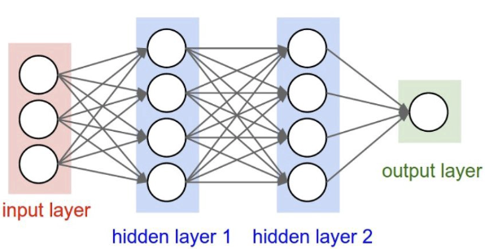

# Neural Networks

### Definition

A neural network is simply a series of layers of interconnected nodes (neurons), where inputs flow through the layers,
its outputs becoming inputs to the next, until we reach the output layer, where we have a result.

In this picture we have 3 inputs, 2 layers comprising 4 neurons, and 1 output layer.



Some layers are labelled as "hidden" because a user of the neural network wouldn't directly interact with them. The user
would just provide inputs, and get outputs. Everything in between from a user's perspective is hidden.

See implementations:

- [Neuron.java](app/src/main/java/javagrad/Neuron.java)
- [Layer.java](app/src/main/java/javagrad/Layer.java)
- [MultiLayerPerceptron.java](app/src/main/java/javagrad/MultiLayerPerceptron.java)

### Neuron

A neuron is simply an object that has a bias, and an associated weight for each of its inputs.

The bias can be seen as the neuron's "trigger happiness".


When an input flows into the neuron, it is manipulated by its weight and bias, to produce an output. If
there are multiple inputs, the output is simply the sum of all outputs.

For example, let the weight be `2`, the bias be `3`. For a single input of `1`, the neuron would
output `1*2+3 = 5`.

The activation function determines whether the or not the neuron will be activated. An activation function will
normalise the outputs to values within a range. Tanh is such a function, with a range between `-1` and `1`:


In the case of this neuron, the output of `5` would become `0.999`, resulting in the neuron being very active.

### Purpose of a neural network

Given an input, and an expected output, a neural network is able to train itself to produce expected outputs given
similar inputs. For example, given the following `2, 3, -1`, we want the neural network to output `1`.

While this may not seem very useful, you could imagine the data set being weather data, or stock market data, and the
output being a prediction of the next value. With ChatGPT for example, the input would be your tokenized text,
and the output would be its prediction based on what it has seen come next, based on its training data.

### Training

So how does the neural network know that given the input `2, 3, -1`, it should return `1`?

The neurons within a neural network are usually initialised with random weights and biases, so indeed given an input, it
is unlikely that the initial prediction is desirable. We must therefore "train" the neural network to produce better and
better predictions.

The training process entails adjusting the weights and biases of the neurons within our network, such that the
predictions get closer to the desired output.

So how do we know how to adjust the weight and biases?

It is first helpful to introduce a "loss" function, which shows how accurate our
predictions are. If we are then able to calculate the relationship between the weights and biases in our neural
network, with respect to the loss, we would be able to adjust the weights and biases to minimise the loss.

For example if the current loss is `5`, and the relationship between the bias of the neuron is `-10`, then increasing
the
bias would reduce the loss. For example adjusting the bias by a small step (`bias + (-0.01 * -10)`) would be a small
step in the right direction.

The relationship between a change in value with respect to another is known as the derivative. For example the
relationship of the rate of change of `a` with respect to `x` is expressed as `dx/da`.

### Derivatives

Take the following expression:

```
a = 2
b = -3
c = 10
d = a * b
e = d + c
```

We can derive how `e` relates to `d` (`de/dd`) as follows:

```
de/dd = ???
e = d + c

Derivative formula is: 
(f(x+h)-f(x))/h

Substitute f(x) for (d+c):
(((d+h+c)-(d+c))/h

Expand:
(d+h+c-d-c)/h 

Simplify:
h/h

de/dd = 1
```

By symmetry, if `de/dd` = 1, then `de/dc` is also equal to `1` (`e = d + c` is equivalent to `e = c + d`).

We also know that for addition, the derivative is proportional, therefore always `1`.

We can now derive how `d` relates to `a` (`dd/da`) as follows:

```
dd/da = ???
d = a * b

Derivative formula is: 
(f(x+h)-f(x))/h

Substitute f(x) for (a*b):
(((a+h)*b)-(a*b))/h

Expand:
((a*b+h*b)-(a*b))/h

Simplify:
(h*b)/h
b

dd/da = -3
```

Again by symmetry, if `dd/da` is `-3`, then `dd/db` is `2` (`d = a * b` is equivalent to `d = b * a`).

The question now is, how do we derive `de/da`? The answer is the chain rule, which tells us that we simply take the
product: `de/da = de/dd * dd/da`. Therefore what we want is `de/da`, what we know is `de/dd = 1`
and `dd/da = -3`, so `de/da = 1 * -3 = -3`.

This process of recursively calculating the derivative of a value with respect to the output is known as "back
propagation", and it is at the core of training a neural network. You can see that knowing how a change in `a`
affects `e`, allows us to adjust the value of `a` to either increase or decrease `e`.

In neural networks these derivatives are known as gradients as they "point" in the direction of the loss. We can
therefore
reduce the loss by adjusting the gradients in the opposite direction of the loss (down!), this process is known as
"gradient descent".

This is a visual example of a mathematical expression where back propagation has occurred, see the gradients for each
node with respect to the loss `L`.


### Training continued

Now that we know how a change to each weight and bias affects our loss, we can iteratively adjust the weights and biases
to minimise the loss. This is known as the training process.

You can see an implementation of back propagation in [Value.java](app/src/main/java/javagrad/Value.java), and an
implementation of the training process in [Main.java](app/src/main/java/javagrad/Main.java). You can run an example
with `./gradlew run`, which given the following inputs:

```java
var inputs=new double[][]{
    {2f,3f,-1f},
    {3f,-1f,0.5f},
    {0.5f,1f,1f},
    {1f,1f,-1f}
    };
```

Wants the following outputs:

```java
var desired=new double[]{1f,-1f,-1f,1f}
```

And this is the result with a `4, 4, 1` neural network as per the diagram above:

```
The neural network has the following number of parameters (weights + biases):
41

Desired output: 
1.0
-1.0
-1.0
1.0

Pre-trained output:
[Value(data=-0.9345251527020428)]
[Value(data=-0.9425965097501219)]
[Value(data=-0.9231186690461907)]
[Value(data=-0.9373495780618403)]

Loss values at different training iterations:
0 7.504916853795351
1 5.630532070955344
2 7.8816264454043345
3 7.788309612536021
4 7.453300718360519
5 4.85366873234484
6 7.910747585448992
7 7.873259193276388
8 7.792547660378221
9 7.545151696471956
10 5.955904559366434
11 7.6961605699945865
12 7.090369959043262
13 3.248022076604102
14 6.078537564767901
15 7.549416382573552
16 5.277735124703394
17 7.94949358394147
18 7.9331202622847945
19 7.9031119779323245
20 7.835565546462825
21 7.613901778410516
22 6.005835603118089
23 6.726193738150357
24 1.6241242791553536
25 7.7903789076960415
26 7.251875719073448
27 0.2454433330239246
28 0.15684153122761357
29 0.029116530235458238
30 0.022265852127908853
31 0.020326367081756332
32 0.01931908181246161
33 0.01859893321336757
34 0.017992826737935314
35 0.017445586296371805
36 0.016937263476652743
37 0.01645947588812753
38 0.016007938005897702
39 0.015579947872324102
40 0.015173494166665349
41 0.01478691992760629
42 0.014418786046009708
43 0.014067809706398916
44 0.013732832444692335
45 0.013412800736905608
46 0.013106752416459429
47 0.012813806160885914
48 0.012533152837268354
49 0.012264048127010974
100 0.005752883805801523
200 0.002752042031360253
300 0.0017917126235200318
400 0.0013230905651750386
500 0.0010466027709224467
600 8.645862331348331E-4
700 7.358632842483947E-4
800 6.401062750043519E-4
900 5.661388656673243E-4

Trained output:
[Value(data=0.9922452836578343)]
[Value(data=-0.9892786465206185)]
[Value(data=-0.98826539754506)]
[Value(data=0.9860526171523375)]
```