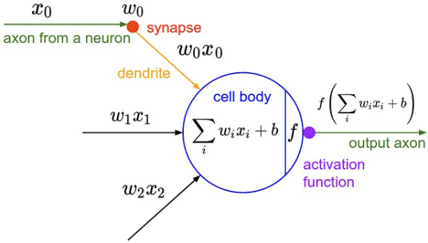

# Neural Networks

### Definition

A neural network is simply a series of layers of interconnected nodes (neurons), where inputs flow through the layers, its outputs becoming inputs to the next, until we reach the output layer, where we have a result.

In this picture we have 3 inputs, 2 layers comprising 4 neurons, and 1 output layer.

### Neuron

A neuron is simply an object that has an associated weight for each of its inputs, and a bias. The bias can be seen as the neuron's "trigger happiness". 

When an input flows into the neuron, it is manipulated by the weight and bias of the neuron, to produce an output. If there are multiple inputs, the output is simply the sum of all outputs.

For example, let the weight be `2`, and the bias be `3`. If there is a single input of `1`, then the neuron would output `1*2+3 = 5`.

### Purpose

An example usage of a neural network, is that given the following data set `2, 3, -1`, we want the neural network to output `1`.

While this may not seem very useful, you could imagine the data set being weather data, or stock market data, and the
output being a prediction of the next value. With ChatGPT for example, the input would be your tokenized text,
and the output would be its prediction based on what it has been trained on.

### Training

So how does the neural network know that given the input `2, 3, -1`, it should return `1`? 

The neurons within a neural network are usually initialised with random weights and biases, so indeed given an input, it is unlikely that the output is desirable. We must therefore "train" the neural network to produce better and better outputs.
